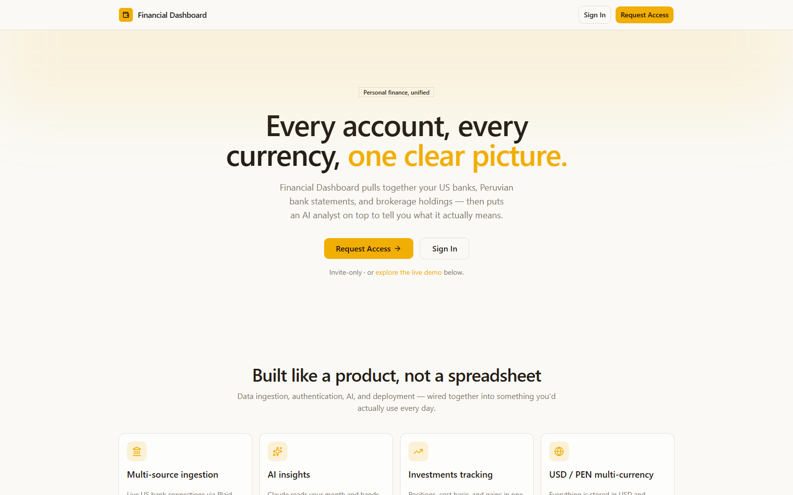
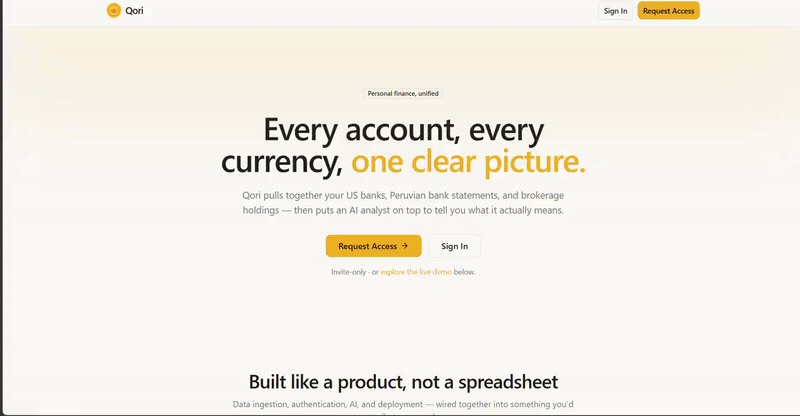

<div align="center">


# Financial Dashboard

**Every account, every currency, one clear picture.**

[](https://nextjs.org)
[](https://www.typescriptlang.org)
[](https://supabase.com)
[](https://plaid.com)
[](https://www.anthropic.com)
[](https://vercel.com)

### [▶ Live demo →](https://finance.qori.land/landing)

</div>

<p align="center">
  
</p>

---

Financial Dashboard is a personal finance platform that unifies a cross-border financial life into a
single view. It pulls **live US bank accounts** through Plaid, parses **Peruvian BCP bank statements
straight from PDF**, and imports **Fidelity brokerage holdings from CSV** — then normalizes everything
to USD and puts an **AI analyst (Claude)** on top to turn the raw data into a candid monthly read on
spending, savings, and portfolio moves. It's a full product end to end: multi-source data ingestion,
authentication, an AI layer, and a deployed multi-currency UI.

> **Try it without an account:** the [live demo](https://finance.qori.land/landing) runs the real
> interface on sample data — click through spending, transactions, investments, and AI insights.

<p align="center">
  
</p>

## What it does

1. **Ingest** — connect US banks via Plaid for live transactions, upload BCP PDF statements (parsed
   server-side with `pdfjs-dist`), and import Fidelity positions from CSV.
2. **Normalize** — every monetary value is stored in USD; BCP amounts are converted at import time,
   and PEN is rendered on demand using a daily-cached exchange rate.
3. **Analyze** — on request, transactions are pre-summarized and sent to Claude, which returns a
   structured analysis (wins, action items, flagged charges, goal allocations, portfolio moves),
   cached for 24 hours.
4. **Track** — net worth, category breakdowns, savings goals, and investment gains — one dashboard,
   toggleable between USD and PEN.

## Highlights

- **Multi-source aggregation** — Plaid (US banks), BCP PDF statements, and Fidelity CSV in one ledger
- **AI insights** — on-demand spending + portfolio analysis via Claude, cached for 24 hours
- **Investments tracking** — positions, cost basis, and gains with AI hold/watch/sell suggestions
- **Multi-currency** — toggle USD ↔ PEN; stored in USD, converted at render time
- **Savings goals** — track progress toward named goals with deadlines
- **Manual balance anchoring** — override live Plaid balances for net-worth accuracy
- **Authentication** — Google OAuth and passkey sign-in via Supabase Auth; row-level security per user

## Tech stack

| Layer | Choice |
|---|---|
| Framework | Next.js 14 App Router, TypeScript 5 strict |
| Database | Supabase (PostgreSQL) |
| Bank connectivity | Plaid SDK |
| AI | Anthropic SDK — Claude Sonnet |
| State | Zustand · React Query |
| UI | shadcn/ui + Tailwind CSS + Recharts |
| PDF parsing | pdfjs-dist (server-side) |
| Hosting | Vercel |

## Run it locally

```bash
npm install
cp .env.example .env.local   # fill in the values below
npm run dev                  # http://localhost:3000
```

Keys you'll need: `NEXT_PUBLIC_SUPABASE_URL`, `NEXT_PUBLIC_SUPABASE_ANON_KEY`,
`SUPABASE_SERVICE_ROLE_KEY`, `PLAID_CLIENT_ID`, `PLAID_SECRET`, `PLAID_ENV`, `ANTHROPIC_API_KEY`,
`BCP_PDF_PASSWORD`. Then apply `supabase/setup.sql` in the Supabase SQL editor, enable the Google
auth provider, and add `http://localhost:3000/auth/callback` to the Supabase redirect allow-list.
Full walkthrough in [docs/deployment.md](docs/deployment.md).

## Roadmap

- Recurring-transaction detection with budget tracking
- Scheduled monthly AI summaries delivered by email
- Broader institution coverage (more banks and brokerages)

## Docs

| Doc | Contents |
|---|---|
| [docs/architecture.md](docs/architecture.md) | System diagram, sign-in flow, request path, security decisions |
| [docs/deployment.md](docs/deployment.md) | Vercel deployment, environment variables, sharing with others |
| [docs/database.md](docs/database.md) | Schema overview, key columns, row-level security |

---

Part of **[Qori](https://qori.land)** · built by **Lucas Ruiz**
