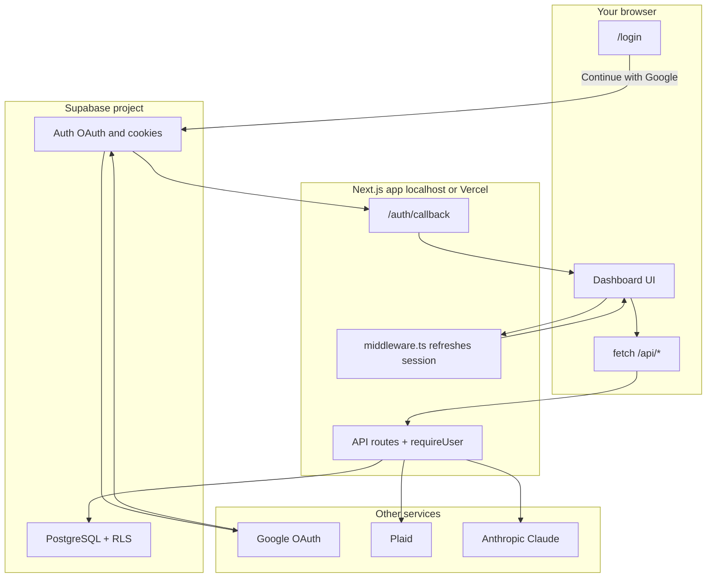
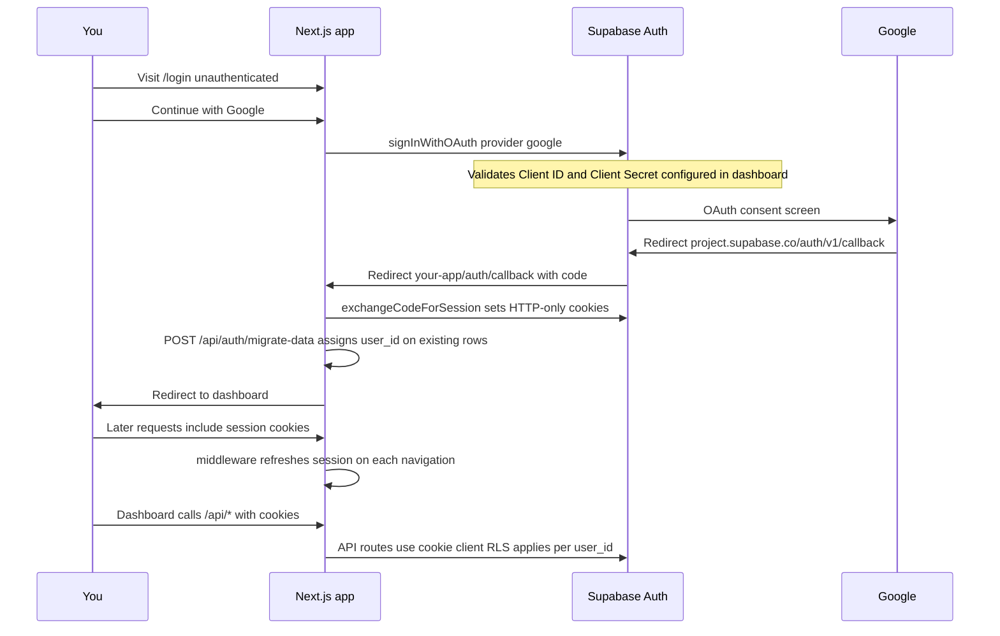
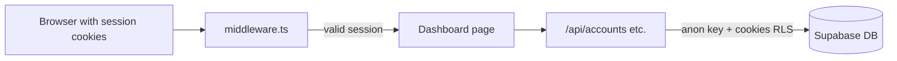

# Financial Dashboard

Personal finance dashboard that aggregates accounts from multiple sources, tracks spending, and surfaces AI-powered insights. Built for a US + Peru financial setup — supports Plaid-connected US bank accounts and BCP (Banco de Crédito del Perú) PDF statement imports with automatic USD/PEN conversion.

---

## Features

- **Multi-source aggregation** — Plaid (US banks) and BCP PDF statements in one unified view
- **AI insights** — on-demand spending analysis via Claude, cached for 24 hours
- **Multi-currency** — toggle between USD and PEN; all values stored in USD, converted at render time
- **Savings goals** — track progress toward named financial goals with deadlines
- **Manual balance anchoring** — override live Plaid balances for net-worth accuracy
- **Authentication** — Google OAuth and passkey sign-in via Supabase Auth; row-level security per user
- **Custom categories** — user-managed spending categories with AI-suggested colors

---

## Tech Stack

| Layer | Choice |
|---|---|
| Framework | Next.js 14 App Router, TypeScript 5 strict |
| Database | Supabase (PostgreSQL) |
| Bank connectivity | Plaid SDK v42 |
| AI | Anthropic SDK — Claude Sonnet |
| State | Zustand (currency localStorage, AI insights sessionStorage) |
| Server cache | React Query (60 s stale time) |
| UI | shadcn/ui + Tailwind CSS v3 + Recharts |
| PDF parsing | pdfjs-dist (server-side) |

---

## How everything connects

The app is a **Next.js** frontend and API layer. **Supabase** handles login and the database. **Google** only appears during sign-in. **Plaid**, **Anthropic**, and exchange-rate APIs are called from server-side API routes after you are authenticated.



### Google sign-in flow (step by step)

This is the path when you click **Continue with Google** on [`app/login/page.tsx`](app/login/page.tsx):



### Where each URL is configured

| URL | Configure in | Purpose |
|-----|----------------|---------|
| `https://<project-ref>.supabase.co/auth/v1/callback` | **Google Cloud** → OAuth client → Authorized redirect URIs | Google returns here after you approve sign-in |
| `http://localhost:3000` | **Google Cloud** → Authorized JavaScript origins | Allowed origin for OAuth (local dev) |
| `http://localhost:3000/auth/callback` | **Supabase** → Authentication → URL Configuration → Redirect URLs | Supabase sends you back to the Next.js app with the auth code |
| `http://localhost:3000` | **Supabase** → Site URL | Default redirect base for Auth |

**Important:** Supabase Google provider requires **both** the Google **Client ID** and **Client Secret**. Client ID alone produces `missing OAuth secret`. Passkeys are optional and need WebAuthn enabled separately in Supabase.

### Request path after login



Unauthenticated visits to dashboard routes or `/api/*` are redirected to `/login` (except `/login`, `/auth/*`, and `/api/auth/*`).

---

## Prerequisites

- Node.js 18+
- A [Supabase](https://supabase.com) project
- A [Plaid](https://plaid.com) account (Sandbox is free)
- An [Anthropic](https://console.anthropic.com) API key

---

## Local Development

### 1. Install dependencies

```bash
npm install
```

### 2. Configure environment variables

Copy the example file and fill in your values:

```bash
cp .env.example .env.local
```

| Variable | Description |
|---|---|
| `NEXT_PUBLIC_SUPABASE_URL` | Supabase project URL |
| `NEXT_PUBLIC_SUPABASE_ANON_KEY` | Supabase anon key (public) |
| `SUPABASE_SERVICE_ROLE_KEY` | Supabase service role key (server-only) |
| `PLAID_CLIENT_ID` | Plaid client ID |
| `PLAID_SECRET` | Plaid secret for the target environment |
| `PLAID_ENV` | `sandbox` \| `development` \| `production` |
| `ANTHROPIC_API_KEY` | Anthropic API key |
| `BCP_PDF_PASSWORD` | Password used to decrypt BCP PDF statements |
| `EXCHANGE_RATE_API_URL` | Optional — overrides the default Frankfurter API base URL |

### 3. Set up the database

Run the full schema against your Supabase project once:

```
Supabase Dashboard → SQL Editor → paste contents of `supabase/setup.sql` → Run
```

If upgrading an existing database that predates auth, also run `supabase/migrations/20260529000000_auth_and_categories.sql` (new projects can skip this).

To wipe financial data and start fresh (e.g. sandbox → production Plaid), run `supabase/reset.sql` — see the comments at the top of that file.

### 4. Configure Supabase Auth (Google OAuth)

1. **Supabase Dashboard** → Authentication → Providers → **Google** → Enable
2. Create OAuth credentials in [Google Cloud Console](https://console.cloud.google.com/apis/credentials):
   - Application type: **Web application**
   - **Authorized JavaScript origins:**
     - `http://localhost:3000` (local dev)
     - `https://your-production-domain.vercel.app` (production)
   - **Authorized redirect URIs:**
     - `https://<your-supabase-project-ref>.supabase.co/auth/v1/callback`
3. Copy the Google **Client ID** and **Client Secret** into the Supabase Google provider settings — **both are required**; missing the secret causes `missing OAuth secret`
4. **Authentication** → URL Configuration:
   - **Site URL:** `http://localhost:3000` (dev) or your production URL
   - **Redirect URLs:** add `http://localhost:3000/auth/callback` and `https://your-domain/auth/callback`

Optional — **passkeys (WebAuthn):** Authentication → Providers → enable WebAuthn if you want passkey sign-in on the login page.

After first login, existing rows without `user_id` are assigned to you automatically via `POST /api/auth/migrate-data` (also triggered from the OAuth callback).

### 5. Start the development server

```bash
npm run dev
```

Open [http://localhost:3000](http://localhost:3000) — you will be redirected to `/login` until signed in.

---

## Project Structure

```
app/
  (dashboard)/        # Route group — all dashboard pages
    page.tsx          # Overview (net worth, spending summary)
    transactions/     # Full transaction list with filters
    categories/       # Manage spending categories
    insights/         # AI-generated spending analysis
  login/              # Google OAuth + passkey sign-in
  auth/callback/      # OAuth callback handler
  api/                # API routes — server-only, all secrets live here
  layout.tsx
  providers.tsx

components/
  ui/                 # shadcn/ui primitives (unstyled, composable)
  layout/             # Sidebar, TopNav, PageWrapper
  dashboard/          # Feature components — display only, no data logic

hooks/                # All data-fetching and mutation logic (React Query)
lib/                  # Server utilities: supabase, plaid, anthropic, currency, bcp/*
stores/               # Zustand stores
types/                # TypeScript interfaces, one file per domain
constants/            # Shared enums and lookup tables
supabase/
  setup.sql           # Create database — run once per environment
  reset.sql           # Wipe financial data — keeps your login
  migrations/         # Legacy upgrades only (skip for new projects)
```

---

## Architecture Notes

See [How everything connects](#how-everything-connects) for diagrams of Google OAuth, middleware, and API → database access.

**Security boundary** — All API keys live exclusively in API routes or Server Components. The only public env vars are `NEXT_PUBLIC_SUPABASE_URL` and `NEXT_PUBLIC_SUPABASE_ANON_KEY`. Dashboard and API routes require authentication; middleware refreshes the Supabase session on each request.

**Row-level security** — All user-owned tables (`accounts`, `transactions`, `goals`, etc.) are scoped by `user_id` with RLS policies. `exchange_rates` remains global (shared across users).

**Currency rule** — All monetary values are stored in USD. Conversion to PEN happens only at render time via `lib/currency.ts`. Nothing else in the codebase does currency math.

**AI budget** — Claude is called only on explicit user action. Results are cached for 24 hours in the `ai_cache` table. Each call uses a pre-summarized payload (≤ 300 tokens input) to keep costs predictable.

**BCP imports** — Statements are deduplicated by SHA-256 file hash stored in `statement_imports`. Re-importing the same PDF fails gracefully. Transactions are converted from PEN to USD at the historical rate for each transaction's date.

---

## Deployment

The app is designed to deploy on [Vercel](https://vercel.com). Push to `master` and Vercel deploys automatically.

**Environment variables** — set the same variables from `.env.local` in Vercel → Project → Settings → Environment Variables. No `.env` file is needed on the server; Vercel injects them at runtime.

**Database** — use a separate Supabase project for production. Run `supabase/setup.sql` once against it before the first deploy.

**Plaid environment** — set `PLAID_ENV=development` and use your Development secret for production. Sandbox is for local development only.

---

## Database Schema

Eight tables:

| Table | Purpose |
|---|---|
| `categories` | Per-user spending categories (system + custom) |
| `plaid_items` | One row per connected institution (Plaid or BCP) |
| `accounts` | Individual accounts within an institution |
| `transactions` | All transactions — `category_source` is `'auto'` or `'manual'` |
| `goals` | Savings goals with target and current amounts |
| `ai_cache` | Cached Claude responses, keyed by period |
| `exchange_rates` | USD→PEN rates cached daily from Frankfurter API (global) |
| `statement_imports` | BCP import history, deduplication via `file_hash` |
