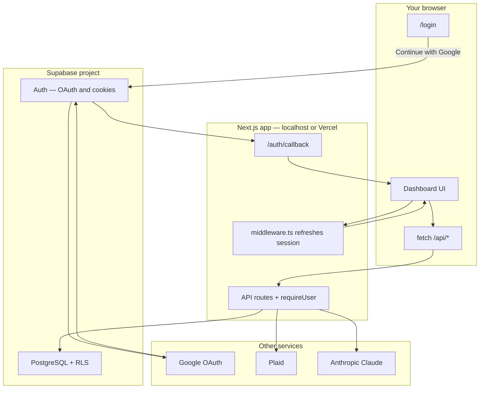
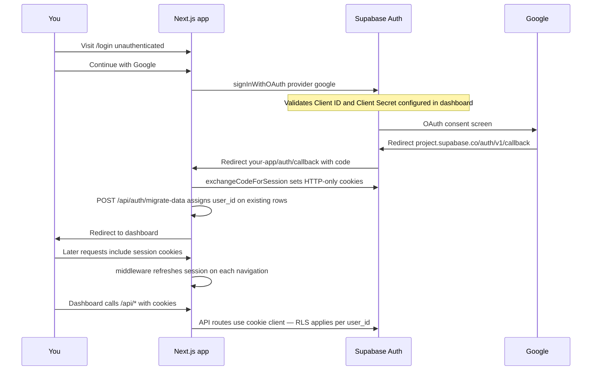
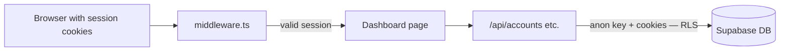

# Architecture

## System Overview

The app is a **Next.js** frontend and API layer. **Supabase** handles login and the database. **Google** only appears during sign-in. **Plaid**, **Anthropic**, and exchange-rate APIs are called from server-side API routes after you are authenticated.



---

## Google Sign-in Flow

This is the path when you click **Continue with Google** on `app/login/page.tsx`:



### URL configuration reference

| URL | Configure in | Purpose |
|-----|----------------|---------|
| `https://<project-ref>.supabase.co/auth/v1/callback` | **Google Cloud** → OAuth client → Authorized redirect URIs | Google returns here after you approve sign-in |
| `http://localhost:3000` | **Google Cloud** → Authorized JavaScript origins | Allowed origin for OAuth (local dev) |
| `http://localhost:3000/auth/callback` | **Supabase** → Authentication → URL Configuration → Redirect URLs | Supabase sends you back to the Next.js app with the auth code |
| `http://localhost:3000` | **Supabase** → Site URL | Default redirect base for Auth |

**Important:** Supabase Google provider requires **both** the Google **Client ID** and **Client Secret**. Client ID alone produces `missing OAuth secret`.

---

## Request Path After Login



Unauthenticated visits to dashboard routes or `/api/*` are redirected to `/login` (except `/login`, `/auth/*`, and `/api/auth/*`).

---

## Security & Design Decisions

**Security boundary** — All API keys live exclusively in API routes or Server Components. The only public env vars are `NEXT_PUBLIC_SUPABASE_URL` and `NEXT_PUBLIC_SUPABASE_ANON_KEY`.

**Row-level security** — All user-owned tables (`accounts`, `transactions`, `goals`, etc.) are scoped by `user_id` with RLS policies. `exchange_rates` remains global (shared across users).

**Currency rule** — All monetary values are stored in USD. Conversion to PEN happens only at render time via `lib/currency.ts`. Nothing else in the codebase does currency math.

**AI budget** — Claude is called only on explicit user action. Results are cached for 24 hours in the `ai_cache` table. Each call uses a pre-summarized payload (≤ 300 tokens input) to keep costs predictable.

**BCP imports** — Statements are deduplicated by SHA-256 file hash stored in `statement_imports`. Re-importing the same PDF fails gracefully. Transactions are converted from PEN to USD at the historical rate for each transaction's date.

---

## Project Structure

```
app/
  (dashboard)/        # Route group — all dashboard pages
    page.tsx          # Overview (net worth, spending summary)
    transactions/     # Full transaction list with filters
    categories/       # Manage spending categories
    insights/         # AI-generated spending analysis
  login/              # Google OAuth + passkey sign-in
  auth/callback/      # OAuth callback handler
  api/                # API routes — server-only, all secrets live here
  layout.tsx
  providers.tsx

components/
  ui/                 # shadcn/ui primitives (unstyled, composable)
  layout/             # Sidebar, TopNav, PageWrapper
  dashboard/          # Feature components — display only, no data logic

hooks/                # All data-fetching and mutation logic (React Query)
lib/                  # Server utilities: supabase, plaid, anthropic, currency, bcp/*
stores/               # Zustand stores
types/                # TypeScript interfaces, one file per domain
constants/            # Shared enums and lookup tables
supabase/
  setup.sql           # Create database — run once per environment
  reset.sql           # Wipe financial data — keeps your login
  migrations/         # Legacy upgrades only (skip for new projects)
```
